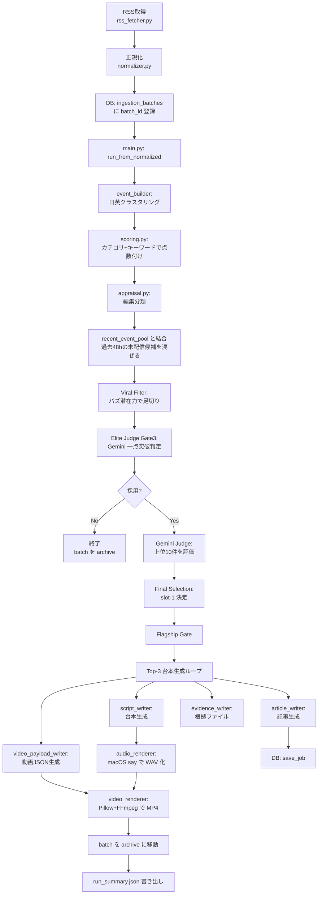
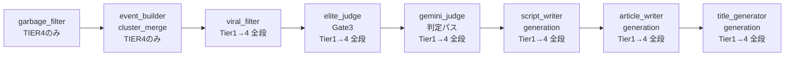

# ARCHITECTURE.md — Hydrangea システム構造ガイド（現状版）

> このドキュメントは、Hydrangea リポジトリの **現在の構造** を、エンジニア素人の方にも理解できるように書いた解説書です。
> 作成日：2026-04-23 時点のコードを読んで作成。

---

## 0. 用語の約束

このドキュメントでは、初出の専門用語には必ず 1 行の注釈を添えます。読み飛ばしたら戻れるよう、ここにも主要な用語をまとめておきます。

| 用語 | 素人向けの意味 |
|---|---|
| **LLM**（Large Language Model） | ChatGPT のような「文章を作る AI」のこと。本システムでは Google の **Gemini** が主役。 |
| **API**（Application Programming Interface） | 他のサービス（Google など）と「プログラム越しに会話する窓口」。 |
| **RSS**（Really Simple Syndication） | ニュースサイトが「最新記事一覧」を機械可読な形で配信する仕組み。 |
| **YAML**（ヤムル） | 人間が読みやすい設定ファイルの書き方。Python では読み込み・書き出しが標準。 |
| **JSON**（ジェイソン） | データをテキストで表す形式。プログラム間のやりとりの定番。 |
| **SQLite**（エスキューライト） | ファイル 1 つで動く軽量データベース。本システムでは `data/db/hydrangea.db`。 |
| **Pydantic**（パイダンティック） | Python で「この形のデータしか入れません」という型検査ライブラリ。 |
| **パイプライン** | 工場のベルトコンベアのように、複数の処理を順番に流す仕組み。 |
| **クラスタリング** | 似たもの同士をグループにまとめる処理。本システムでは「同じニュース事件を扱う複数の記事を 1 つの『イベント』にまとめる」こと。 |
| **トリアージ**（Triage） | もともと医療用語で「重症度で優先順位をつける」こと。本システムでは「どのニュースを動画化するか優先順位付けする」工程。 |
| **TTS**（Text-To-Speech） | 文章を音声に変換する技術。本システムでは macOS 標準の `say` コマンドを利用。 |
| **FFmpeg**（エフエフエムペグ） | 動画・音声を加工する業界標準ツール。本システムでは `imageio-ffmpeg` 経由で呼び出し。 |
| **フォールバック**（Fallback） | メインがダメだった時の「代替案」。本システムでは Gemini がエラーの時に別モデルに切り替える、など。 |
| **クォータ**（Quota） | API の「使用量制限」（例：1 日 500 回まで）。超えると 429 エラー。 |

---

## 1. このシステムは要するに何をしているか（1 行サマリー）

> **世界中のニュース RSS を読み込み、「日本と海外で報道のズレがあるネタ」を AI が選んで、TikTok / YouTube Shorts 用の縦型ショート動画（の台本・音声・MP4）を自動生成するシステム。**

もう少し噛み砕くと：

1. **集める**：NHK・Reuters・Al Jazeera など 19 媒体の RSS から最新記事を取得
2. **まとめる**：同じ事件を扱う日本語記事と英語記事を 1 つの「イベント」に束ねる
3. **選ぶ**：AI（Gemini）が「これは動画にする価値がある」というネタを 1 日 3 本まで選定
4. **書く**：動画の台本（約 80 秒、Hook → Setup → Twist → Punchline の 4 部構成）と Web 記事を LLM に書かせる
5. **作る**：macOS の音声合成 `say` で読み上げ、`Pillow + FFmpeg` で 720×1280 の縦型 MP4 を組み立てる

---

## 2. ディレクトリ構造の全体図

```
hydrangea-news-poc/
├── .env                          # APIキーなど秘密情報（Gitには含めない想定）
├── .env.example                  # .envのテンプレート（公開OK）
├── .gitignore                    # ★バグあり：「.venv/」が効いていない（TECH_DEBT参照）
├── README.md                     # プロジェクト概要
├── requirements.txt              # Pythonライブラリ一覧
│
├── configs/                      # ★YAML設定（今後マルチチャンネル化の中心）
│   ├── sources.yaml              # 取得するニュースRSSのURL一覧
│   └── source_profiles.yaml      # 媒体ごとの格付け・表示名
│
├── data/                         # Git管理外（.gitignoreで除外済）
│   ├── input/                    # サンプル用の入力JSON（テスト実行用）
│   ├── raw/                      # RSS取得の生データ
│   ├── normalized/               # 取得データを正規化したJSON
│   ├── output/                   # 生成成果物（台本・記事・動画・ログ）
│   ├── archive/                  # 処理済みバッチの退避場所
│   └── db/                       # SQLiteファイル（hydrangea.db）
│
├── src/                          # ★本体コード（約21,000行）
│   ├── main.py                   # エントリポイント（3,303行。全パイプラインの司令塔）
│   ├── budget.py                 # LLM呼び出し回数の予算管理
│   │
│   ├── shared/                   # 共通ユーティリティ
│   │   ├── config.py             # 環境変数の読み込み（.env → Python変数）
│   │   ├── logger.py             # ロガー設定
│   │   └── models.py             # Pydanticデータモデル（NewsEvent/VideoScript等）
│   │
│   ├── ingestion/                # 【工程1】ニュース取り込み
│   │   ├── rss_fetcher.py        # RSS取得（feedparser使用）
│   │   ├── normalizer.py         # 取得データを共通フォーマットに整形
│   │   ├── loader.py             # JSONファイルからNewsEventを復元
│   │   ├── event_builder.py      # 日英記事のクラスタリング（1,496行・要所）
│   │   ├── cross_lang_matcher.py # 日英タイトルの照合（693行）
│   │   ├── source_profiles.py    # source_profiles.yamlを読む
│   │   ├── discovery_audit.py    # RSSの取得成功率レポート
│   │   ├── debug_reports.py      # クラスタ分析レポート
│   │   └── run_ingestion.py      # 取り込みだけを独立実行するCLI
│   │
│   ├── triage/                   # 【工程2】ニュース選定（優先度付け）
│   │   ├── engine.py             # rank_events / pick_top
│   │   ├── scoring.py            # 点数計算（1,128行・ハードコード多数）
│   │   ├── appraisal.py          # 編集的分類（698行）
│   │   ├── prompts.py            # 選定用LLMプロンプト（日本向け文言）
│   │   ├── coherence_gate.py     # 「日英ペアが本当に同じ話題か」検証（674行）
│   │   ├── gemini_judge.py       # Geminiによる"編集長"判定（445行）
│   │   ├── scheduler.py          # 1日分の番組表作成（722行）
│   │   ├── viral_filter.py       # バズり潜在力の判定（367行）
│   │   ├── garbage_filter.py     # ゴミ記事の除外
│   │   ├── freshness.py          # ニュース鮮度の減衰計算
│   │   └── story_fingerprint.py  # 重複ストーリー判定用の指紋
│   │
│   ├── generation/               # 【工程3】動画・記事の素材生成
│   │   ├── script_writer.py      # 台本（4部構成・約80秒）生成（984行・要所）
│   │   ├── article_writer.py     # Web記事生成（519行）
│   │   ├── title_generator.py    # サムネ用タイトル生成（467行）
│   │   ├── evidence_writer.py    # 根拠ファイル（evidence.json）生成
│   │   ├── video_payload_writer.py # 動画用JSON生成（★Remotion移行の中心）
│   │   ├── audio_renderer.py     # TTS音声合成（macOS `say` 使用・281行）
│   │   └── video_renderer.py     # MP4組み立て（Pillow+FFmpeg・532行★Remotion移行で廃止対象）
│   │
│   ├── llm/                      # LLM呼び出し抽象化
│   │   ├── base.py               # 共通インターフェース LLMClient
│   │   ├── factory.py            # 役割別クライアント生成（352行）
│   │   ├── gemini.py             # Gemini 実装
│   │   ├── groq.py               # Groq 実装（未使用）
│   │   ├── ollama.py             # Ollama 実装（未使用）
│   │   ├── judge.py              # 編集判定用
│   │   ├── schemas.py            # LLM出力のPydanticスキーマ
│   │   ├── retry.py              # リトライロジック
│   │   └── model_registry.py     # モデルレジストリ（227行）
│   │
│   ├── storage/                  # SQLite 永続化
│   │   └── db.py                 # ジョブ・イベント・予算・プール管理（509行）
│   │
│   └── render/                   # 既存候補の再レンダリング
│       └── run_render.py         # 動画だけ作り直すCLI（391行）
│
└── tests/                        # pytestテスト（31ファイル・約30テストスイート）
    ├── test_main_smoke.py        # エンドツーエンド最小確認
    ├── test_scoring.py           # スコア計算
    ├── test_script_writer.py     # 台本生成
    ├── test_video_renderer.py    # 動画組み立て
    ├── test_budget.py            # 予算管理
    └── ... 他 26 ファイル
```

### 「つまり何？」サマリー

- **`configs/` は「どこから取ってくるか」の設定**。今後のマルチチャンネル化の拠点。
- **`src/ingestion/` は入口**。世界の RSS を拾ってきて整形する。
- **`src/triage/` は編集会議**。どのニュースを動画にするか AI が判定する。
- **`src/generation/` は制作室**。台本・記事・音声・動画を作る。
- **`src/llm/` は AI 外注窓口**。Gemini などとの通信を集約。
- **`src/storage/` は記録簿**。過去に何を作ったか、予算をいくら使ったかを SQLite に記録。
- **`src/main.py` は総合プロデューサー**。上記を全部順番に呼び出す。3,303 行ある巨大なオーケストレーション層。

---

## 3. 各ファイルの「つまり何？」説明

### 3.1 ルート直下

| ファイル | つまり何？ |
|---|---|
| `.env` | API キーや予算上限などの**秘密情報**。Git には含めない約束（ただし .gitignore にバグあり → TECH_DEBT 参照）。 |
| `.env.example` | `.env` のテンプレート。キーを書かない形で Git に含める。 |
| `.gitignore` | Git の管理から外すファイル／フォルダを指定。**現状バグあり**（5 行目 `data/` と 1 行目 `.env.venv/` の書き方が怪しく `.venv/` が漏れる）。 |
| `README.md` | プロジェクト概要（少し古い）。`src/main.py` 最新機能はここに書かれていない。 |
| `requirements.txt` | 依存ライブラリ：pydantic, python-dotenv, pytest, google-genai, feedparser, pyyaml。 |

### 3.2 configs/

| ファイル | つまり何？ |
|---|---|
| `configs/sources.yaml` | **どのニュースサイトの RSS を取りに行くか** の一覧。19 媒体 enabled、5 媒体 disabled。国・言語・地域・優先度・type を媒体ごとに記述。**マルチチャンネル化の時はここをチャンネル別に分割する予定**。 |
| `configs/source_profiles.yaml` | **媒体の格付け**（top/major/standard）と、台本に媒体名を出すときの表示名（例：`Financial Times` → `英FT`）。 |

### 3.3 src/shared/

| ファイル | つまり何？ |
|---|---|
| `config.py` | `.env` を読み込んで Python 定数にする橋渡し。予算（`LLM_CALL_BUDGET_PER_DAY`）、モデル名（`GEMINI_MODEL_TIER1` など）、動画サイズ（`VIDEO_WIDTH=720, VIDEO_HEIGHT=1280, VIDEO_FPS=30`）などをここで定義。 |
| `logger.py` | ログ出力の共通設定。`logger = get_logger(__name__)` で取得。 |
| `models.py` | パイプライン全体で使うデータの「型」定義。**Pydantic** を使用。主要モデル：`NewsEvent`, `ScoredEvent`, `VideoScript`, `VideoPayload`, `GeminiJudgeResult`, `SourceRef`, `DailySchedule`。 |

### 3.4 src/ingestion/（取り込み）

| ファイル | つまり何？ |
|---|---|
| `rss_fetcher.py` | `configs/sources.yaml` を読んで、各 RSS から最新記事（最大 50 件/媒体）を取る。`feedparser.parse(url)` を呼ぶだけのシンプル実装。 |
| `normalizer.py` | 取得したバラバラな形式を統一 JSON（`id`/`title`/`summary`/`url`/`source_name`/`country`/`category`/`published_at`/`region`/`language`）に揃える。HTML タグを正規表現で除去。 |
| `loader.py` | サンプル実行用。JSON ファイルから `NewsEvent` リストを復元（18 行）。 |
| `event_builder.py` | **このシステムの心臓部の 1 つ**。1,496 行。日本語記事と英語記事を「同じ事件」でクラスタリングする。キーワードベースの BFS（幅優先探索）＋ オプションで LLM による「同じ事件か？」判定。**ハードコードされた地政学キーワード（israel, iran, trump, boj など）多数**。 |
| `cross_lang_matcher.py` | 693 行。日英の辞書（日本→japan, 米国→usa, 日銀→boj, 利上げ→rate hike など 38 項目以上）でタイトル同士を照合する。 |
| `source_profiles.py` | `source_profiles.yaml` を読み、台本で引用する媒体 2 社を選ぶ（`select_authority_pair()`）。 |
| `discovery_audit.py` | 取得失敗の多い RSS を検出するレポート作成。 |
| `debug_reports.py` | クラスタリング結果の診断レポート。 |
| `run_ingestion.py` | 「取り込みだけ」を CLI で回したい時のエントリ。 |

### 3.5 src/triage/（選定）

| ファイル | つまり何？ |
|---|---|
| `engine.py` | `rank_events(events)` と `pick_top(events)` のミニ関数。 |
| `scoring.py` | **このシステムの編集方針が最もハードコードされている場所**。1,128 行。カテゴリ別ベース点（economy=85, politics=80, technology=75, sports=60, entertainment=55）、日本向けキーワード（利上げ+10, 増税+8, 少子化+7 など）、地政学ボーナス、クロス言語ボーナスなどを合計してスコアを出す。 |
| `appraisal.py` | 698 行。スコア結果を「linked_jp_global（日英両方あり）」「blind_spot_global（海外のみ・日本インパクト大）」「jp_only」「insufficient_evidence」「investigate_more」に分類。 |
| `prompts.py` | LLM に渡す編集方針プロンプト。**全文日本語**。「日本では見えない世界との認識差を突く」というコンセプトが明文化されている（115 行）。 |
| `coherence_gate.py` | 674 行。「首相動静」「決算短信」のような**国内ルーティンニュース**を検出して、意味的に海外記事と無関係な組み合わせを却下する門番。 |
| `gemini_judge.py` | 445 行。Gemini を「上級編集者」として呼び出し、候補の編集価値（divergence_score, blind_spot_global_score, authority_signal_score など 0〜10 点）を評価させる。429/503 エラーをハンドリング。 |
| `scheduler.py` | 722 行。「今日の 5 枠」を決める番組表作成ロジック。 |
| `viral_filter.py` | 367 行。TikTok でバズりそうかを別軸で採点（0-100）。閾値未満は破棄。 |
| `garbage_filter.py` | 明らかなスパム・クリックベイトを Tier4 の軽量 LLM で除外。 |
| `freshness.py` | 時間経過による鮮度減衰（24h→0.90倍、48h→0.65倍、以降は捨てる）。 |
| `story_fingerprint.py` | タイトルから 16 文字の指紋を作り、「同じ話を 72 時間以内に配信済み」なら抑制。 |

### 3.6 src/generation/（生成）

| ファイル | つまり何？ |
|---|---|
| `script_writer.py` | 984 行。**動画台本ジェネレータ**。4 ブロック（hook 4秒 / setup 16秒 / twist 40秒 / punchline 20秒）を LLM に書かせる。文字数範囲（例：twist 150〜220 字）を Python でハードバリデーションし、違反すれば 3 回までリトライ。ハードコードされた日本語編集指示多数（「武器庫6パターン」など）。 |
| `article_writer.py` | 519 行。Web 記事（Markdown）を LLM に書かせる。 |
| `title_generator.py` | 467 行。サムネ用の「3 層タイトル + サムネイルテロップ」を LLM に書かせる（`canonical_title` / `platform_title` / `hook_line` / `thumbnail_text`）。 |
| `evidence_writer.py` | 316 行。台本の根拠（どの媒体のどの記事を参照したか）を `evidence.json` にまとめる。 |
| `video_payload_writer.py` | 483 行。**動画制作用 JSON**（scenes, 視覚ヒント, 遷移ヒント）を組み立てる。★ **Remotion 移行の際、ここが出力スキーマの中心になる**。 |
| `audio_renderer.py` | 281 行。台本を **macOS `say`** コマンドで読み上げて WAV 化。失敗時は無音でパディング。 |
| `video_renderer.py` | 532 行。**現行の動画組み立て**。`Pillow` でフレーム画像を作り、`imageio-ffmpeg` で MP4 化、最後に `subprocess` で `ffmpeg` を直接叩いて音声をマルチプレックス。★ **Remotion 移行で丸ごと置き換わる予定**。 |

### 3.7 src/llm/

| ファイル | つまり何？ |
|---|---|
| `base.py` | 共通インターフェース `LLMClient` を定義（12 行）。 |
| `factory.py` | 352 行。**役割別クライアント**（garbage_filter, merge_batch, judge, generation, viral_filter）を返す関数群。Gemini は TIER1→TIER2→TIER3→TIER4 の階層フォールバック。クォータ超過時に次の Tier に自動切替。 |
| `gemini.py` | 21 行。`google-genai` SDK の薄いラッパー。 |
| `groq.py`, `ollama.py` | 別プロバイダ用（現在 未使用）。 |
| `judge.py`, `schemas.py` | Judge 用プロンプト実行と Pydantic スキーマ。 |
| `retry.py` | 82 行。429/503 エラー時の指数バックオフ。 |
| `model_registry.py` | 227 行。起動時に利用可能なモデル一覧を確認して、指定モデルが無い時に最適代替を探す。 |

### 3.8 src/storage/

| ファイル | つまり何？ |
|---|---|
| `db.py` | 509 行。SQLite の DDL（テーブル定義）と CRUD。WAL モードで並行書き込み対応。主要テーブル：`jobs`, `events`, `daily_stats`, `ingestion_batches`, `seen_article_urls`, `recent_event_pool`。 |

### 3.9 src/render/

| ファイル | つまり何？ |
|---|---|
| `run_render.py` | 391 行。すでに台本が出来ている `event_id` を指定して、音声＋動画だけ作り直す CLI モード。 |

### 3.10 src/main.py

| 行数 | つまり何？ |
|---|---|
| 3,303 行 | **全パイプラインの司令塔**。`run_from_normalized()`（実ニュースモード）と `run()`（サンプルモード）の 2 つが主役。中で `_generate_outputs()`（台本→記事→動画ペイロード）、`_run_judge_pass()`、`_render_av_outputs()`（音声→MP4）を順に呼ぶ。`_save_run_summary()` で `run_summary.json` という運用ダッシュボード用の大きな JSON を書き出す。 |

---

## 4. 処理の流れ（Mermaid 図）

### 4.1 全体像（実ニュースモード）



### 4.2 LLM 呼び出しが発生する場所（予算管理の対象）



> **補足**：「Tier1→4 全段」は、Tier1 が 429/503 でダメなら Tier2、それもダメなら Tier3…と順に降りる方式。各 Tier で 3 回まで指数バックオフ。

---

## 5. 外部 API 呼び出しの全リスト

### 5.1 クラウド LLM API

| 呼び出し先 | 使用ファイル | 目的 | モデル |
|---|---|---|---|
| **Gemini API** (`google-genai`) | `src/llm/gemini.py:12-21` | LLM 推論全般 | `gemini-3.1-flash-lite-preview`（TIER1） ほか 3 Tier |
| Gemini | `src/llm/factory.py:60-146` | 階層フォールバック制御 | 同上 |
| Gemini | `src/triage/gemini_judge.py` | 編集価値判定（上級編集者役） | 判定用 Tier1〜4 |
| Gemini | `src/llm/judge.py` | Elite Judge（一点突破判定） | Tier1〜4 |
| Gemini | `src/generation/script_writer.py:716` 付近 | 動画台本の本文生成 | Tier1〜4 |
| Gemini | `src/generation/article_writer.py` | Web 記事生成 | Tier1〜4 |
| Gemini | `src/generation/title_generator.py` | サムネ用タイトル | Tier1〜4 |
| Gemini | `src/ingestion/event_builder.py:799-825` | クラスタ合体の真偽判定 | TIER4 固定 |
| Gemini | `src/ingestion/cross_lang_matcher.py:592-661` | 日英ペアの同一性判定 | TIER4 固定 |
| Gemini | `src/triage/garbage_filter.py` | ゴミ記事の除外判定 | TIER4 固定 |
| Gemini | `src/triage/viral_filter.py` | バズ潜在力スコア | Tier1〜4 |
| Groq API | `src/llm/groq.py:1-23` | 代替プロバイダ（**現在未使用**、設定のみ存在） | llama-3.3-70b-versatile |
| Ollama | `src/llm/ollama.py:1-24` | ローカル LLM（**現在未使用**） | llama3.2 |

### 5.2 外部 HTTP 取得

| 呼び出し先 | 使用ファイル | 目的 |
|---|---|---|
| **RSS フィード各社** | `src/ingestion/rss_fetcher.py:58`（`feedparser.parse(url)`） | NHK, Reuters, Al Jazeera など 19 媒体の RSS 取得 |

### 5.3 ローカル subprocess

| コマンド | 使用ファイル:行 | 目的 | フォールバック |
|---|---|---|---|
| `say` (macOS TTS) | `src/generation/audio_renderer.py:120-130` | 台本を音声化して WAV にする | FileNotFoundError → 無音でパディング（文字数×0.06 秒） |
| `ffmpeg` (imageio-ffmpeg 同梱) | `src/generation/video_renderer.py:407-422` | 動画に音声をマルチプレックス | mux 失敗 → 無音の動画のみを review MP4 として出力 |
| `imageio.get_writer`（内部で ffmpeg） | `src/generation/video_renderer.py:366-382` | MP4 エンコード（libx264, quality=7） | 例外 → manifest に error を書いて終了 |

---

## 6. 環境変数・設定項目の一覧

全設定は次の 3 箇所に集約されています：

1. **`.env`（秘密情報）** — API キー、予算、モデル名
2. **`src/shared/config.py`** — `.env` を Python 定数として読み込む唯一の経路
3. **`configs/*.yaml`** — ニュースソースと媒体プロファイル

### 6.1 `.env` / `.env.example` の環境変数

| 変数名 | デフォルト値 | 何？ |
|---|---|---|
| `LLM_PROVIDER` | `gemini` | 使う LLM。`gemini` / `groq` / `ollama` から選ぶ。 |
| `GEMINI_API_KEY` | （空） | Google AI Studio で取得する API キー。**秘密**。 |
| `GEMINI_MODEL_TIER1` | `gemini-3.1-flash-lite-preview` | メイン LLM。1 日 500 回まで。 |
| `GEMINI_MODEL_TIER2` | `gemini-3.0-flash` | 台本専用の温存枠。 |
| `GEMINI_MODEL_TIER3` | `gemini-2.5-flash` | 予備。 |
| `GEMINI_MODEL_TIER4` | `gemini-2.5-flash-lite` | 最終防衛線（最軽量）。 |
| `RUN_MODE` | `publish_mode` | `publish_mode`＝予算保護あり / `research_mode`＝予算上限なし。 |
| `MAX_PUBLISHES_PER_DAY` | `5` | 1 日の最大公開数。 |
| `LLM_CALL_BUDGET_PER_RUN` | `150` | 1 回の run あたり LLM 呼び出し上限。 |
| `LLM_CALL_BUDGET_PER_DAY` | `1000` | 1 日あたり LLM 呼び出し上限。 |
| `PUBLISH_RESERVE_CALLS` | `15` | production ステージ用に常時確保する LLM 呼び出し数。 |
| `EN_CANDIDATES_PER_JP_CLUSTER` | `2` | 1 JP クラスタあたり比較する EN 候補数。 |
| `AUDIO_RENDER_ENABLED` | `false` | true で `say` を呼び出して音声化。 |
| `VIDEO_RENDER_ENABLED` | `false` | true で MP4 まで作る。 |
| `TTS_VOICE` | `Kyoko` | macOS `say` の声。 |
| `TTS_FRAMERATE` | `22050` | WAV サンプルレート（Hz）。 |
| `TTS_TIMEOUT_SEC` | `60` | TTS タイムアウト。 |
| `VIDEO_WIDTH` | `720` | 動画幅 px。 |
| `VIDEO_HEIGHT` | `1280` | 動画高さ px（9:16 縦型）。 |
| `VIDEO_FPS` | `30` | 動画フレームレート。 |
| `INPUT_DIR` / `OUTPUT_DIR` / `NORMALIZED_DIR` / `ARCHIVE_DIR` / `DB_PATH` | `data/input` ほか | ファイルパス。 |
| `LOG_LEVEL` | `INFO` | ログ詳細度。 |
| `JUDGE_ENABLED` | `true` | Gemini Judge のオン／オフ。 |
| `JUDGE_CANDIDATE_LIMIT` | `3` | Judge にかける候補数。 |
| `GEMINI_CALL_INTERVAL_SEC` | `0.5` | API 連続呼び出し間の最小間隔（秒）。 |
| `GARBAGE_FILTER_ENABLED` | `true` | Gate1（ゴミ記事除外）オン／オフ。 |
| `ELITE_JUDGE_ENABLED` | `true` | Gate3（一点突破判定）オン／オフ。 |
| `ELITE_JUDGE_CANDIDATE_LIMIT` | `10` | Elite Judge にかける最大候補数。 |
| `VIRAL_FILTER_ENABLED` | `true` | バズフィルタのオン／オフ。 |
| `VIRAL_SCORE_THRESHOLD` | `40.0` | この値未満の候補は生成前に却下。 |
| `VIRAL_PRESCORE_TOP_N` | `20` | Viral Filter に進める上位件数。 |
| `VIRAL_LLM_ENABLED` | `true` | バズ判定に LLM を使うか（false でルールベースのみ）。 |

### 6.2 `configs/sources.yaml`（どの媒体を取るか）

- `sources:` リストの各要素に `country`, `name`, `rss_url`, `enabled`, `priority`, `language`, `region`, `source_type`, `bridge_source`, `licensing_notes` が入る。
- 2026-04 時点 19 媒体 enabled（NHK系3, Nikkei, Asahi, Reuters, APNews, BBC, Bloomberg, FT, AlJazeera, France24, CNA, Guardian, LeMonde, DerSpiegel, Yonhap, StraitsTimes, TimesOfIndia, ABCNewsAU など）。

### 6.3 `configs/source_profiles.yaml`（媒体の格付け）

- `profiles:` リストで媒体ごとに `tier`（top/major/standard）, `mention_style_short`（台本内の呼び方、例「英FT」「米ロイター」）, `can_authority_mention`（true なら台本で引用可）を指定。

### 6.4 `src/shared/config.py` の役割

- `.env` を `python-dotenv` で読み、全ての設定を Python の大文字定数として公開する。
- 「**`.env` → `config.py` → ビジネスロジック** の順でしか環境変数を参照しない」というルールがコメントで明示されている（`src/shared/config.py:90-93`）。
- `BASE_DIR = Path(__file__).resolve().parents[2]` で相対パス解決するので、作業ディレクトリに依存しない。

---

## 7. 生成物（出力ファイル）の一覧

`data/output/` 配下に 1 回の実行で次のファイル群が作られます。

| ファイル | 内容 |
|---|---|
| `{event_id}_script.json` | VideoScript（4 ブロック台本、hook/setup/twist/punchline 各セクション + director_thought ほかメタデータ） |
| `{event_id}_article.md` | WebArticle（Markdown 形式の記事） |
| `{event_id}_video_payload.json` | VideoPayload（動画制作用の構造化 JSON — **Remotion 移行で props として使われる** ） |
| `{event_id}_evidence.json` | 引用元の媒体名・URL・タイトルのリスト |
| `{event_id}_voiceover.wav` | 台本を読み上げた PCM WAV（モノラル 22050Hz 16bit） |
| `{event_id}_voiceover_segments.json` | 音声セグメントごとのタイミング manifest |
| `{event_id}_review.mp4` | 組み立て済みレビュー用 MP4（720×1280, 30fps） |
| `{event_id}_render_manifest.json` | 動画レンダリングのメタデータ（成否、尺、エラー） |
| `triage_scores.json` | 今回の選定結果（採用＋全候補のスコア内訳） |
| `daily_schedule.json` | 1 日分の番組表 |
| `run_summary.json` | 運用ダッシュボード用の総合 JSON（予算・判定結果・AV 状態） |
| `latest_candidate_report.md` | 「なぜ slot-1 が選ばれたか」の人間可読レポート |
| `judge_report.json` / `followup_queries.json` / `followup_queries.md` | Judge が「もう少し調査が必要」と判定した時のレスキューファイル |
| `debug/source_load_report.json` 他 | 取得成功率などの診断レポート |
| `discovery_audit.json` | 上位 N 件の探索監査ログ |

---

## 8. データベース（SQLite）のテーブル一覧

`data/db/hydrangea.db` に次のテーブルが作られます（`src/storage/db.py:13-79`）。

| テーブル | 役割 |
|---|---|
| `jobs` | 1 回の実行単位。`status`（completed/failed/skipped）、生成物パス、エラーを記録。 |
| `events` | 動画化したニュースイベントの履歴。 |
| `daily_stats` | 日ごとの累積統計（LLM 呼び出し回数、公開数、実行数）。予算管理の根幹。 |
| `ingestion_batches` | 取り込みバッチ。`status`（pending → processing → archived）で進行管理。 |
| `seen_article_urls` | 重複記事排除のための URL 履歴。 |
| `recent_event_pool` | 直近 48h の「未配信」候補を保持する「転がり比較窓」。期限切れで自動 expire。 |

---

## 9. なぜこのアーキテクチャが重要か（補足）

- **「なぜ LLM を階層化しているか」**：Google の Gemini には無料枠クォータ（RPD=requests per day）があり、TIER1 の 500 回/日を食い潰すと生成ができなくなる。そのため TIER1→TIER2→TIER3→TIER4 の順に安定モデルにフォールバックして、**1 日 5 本の動画を必ず出せる**ようにしている。
- **「なぜ予算管理があるか」**：1 run で約 12〜15 回の LLM 呼び出しが発生する。`publish_mode` は `PUBLISH_RESERVE_CALLS=15` を必ず温存し、台本＋記事の本番生成が途中で止まらないよう探索系（cluster_merge / viral_filter / judge）を早期打ち切りする仕組み。
- **「なぜ recent_event_pool があるか」**：RSS は「今回のバッチでは来なかったが 12 時間前には来ていた」ケースが多い。48h 以内の未配信候補をプールから復元することで**ストーリーの取りこぼしを防いでいる**。
- **「なぜ `run_summary.json` にあんなに情報があるか」**：本システムは運用時のデバッグが重要（なぜ slot-1 がこれになったか、どこで予算切れが起きたか）。`run_summary.json` はそのための「1 run すべての履歴」を 1 ファイルに記録している。

---

## 10. 次に読むべきドキュメント

- **`docs/TECH_DEBT.md`** — 今見つかっている技術的負債（**重要なセキュリティ問題あり** ）
- **`docs/REFACTORING_PLAN.md`** — 3 チャンネル対応化と Remotion 移行の改修計画

---

*最終更新: 2026-04-23 / 作成者: Claude*
